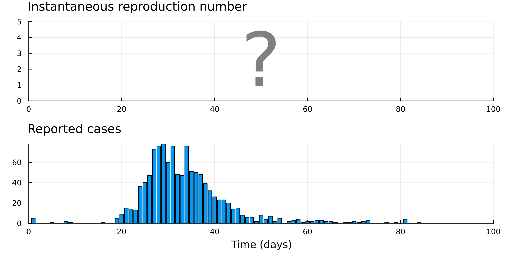

# An introduction to SMC methods for $R_t$ estimation

Estimation of the instantaneous reproduction number is a well-researched problem in infectious disease epidemiology. We introduce a simple framework using sequential Monte Carlo (SMC) methods. Our approach:

👍 Is conceptually simple  
👍 Flexible  
👍 Produces valid credible intervals  
👍 Can accommodate underreporting, missing/incomplete data, imported cases, uncertain serial intervals, temporally aggregated data, multiple data sources, etc - all at the same time!

This repository contains all data, scripts, and notebooks required to follow along with the [tutorial](todo.link).

This tutorial is designed for researchers with a basic understanding of statistical inference. We walk through the steps of constructing an SMC model to build a gold-standard $R_t$ estimator, fine-tuned for your purposes, from scratch. This balances the convenience of an off-the-shelf method, with the flexibility and deep understanding that comes with constructing a model from first principles.

We also highlight the accompanying paper, [An introduction to sequential Monte Carlo methods for reproduction number estimation](link.link).




## Getting started

We avoid using any external dependencies, so you can run all code in this repository with a standard Julia installation. To get started, all you need to do is:
1. Install Julia from [julialang.org](https://julialang.org/downloads/)
2. Clone this repository
3. Run Julia in your terminal and run:

```julia
using Pkg
Pkg.add("IJulia")
using IJulia
notebook()
```

This will open a Jupyter notebook in your browser. Navigate to the github repository and open `main.ipynb` to get started.

*Alternatively, you can open the cloned repository in VS Code (or your preferred IDE) and run the notebooks this way. If using VS Code, we recommend installing the [Julia extension](link.link).*

## Structure of this repository

The files and folders you should care about:
- `gettingstarted.ipynb`: A jupyter notebook to help with setup and navigation
- `/notebooks/`: Contains the main tutorial notebooks
- `/data/`: Contains all example data used in the tutorial
- `/src/`: Contains crticial source code

You can ignore (but feel free to explore):
- `/docs/`: Contains the rendered tutorial
- `/site/`: Contains the quarto website files (these are rendered to `/docs/`)
- `/assets/`: Contains images and other assets used in the tutorials and readme files
- Files like `.gitignore` and `.nojekyll` which are for repo management

